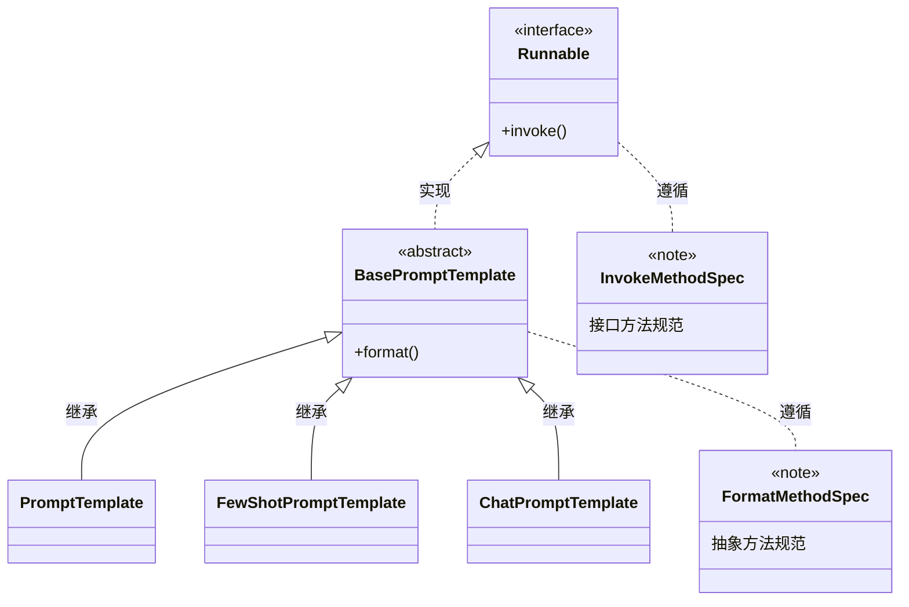

# **学习到的知识**

## **提示词工程**

|术语|内容|
|---|---|
|zero-shot learning|**零样本学习**，指的是在训练阶段不存在与测试阶段完全相同的类别，但是模型可以使用训练过的知识推理到测试集中的新类别上   在提示词优化中，不提供示例，仅仅通过语言描述任务要求、目标和约束，让模型直接生成结果。用语言定义任务，解放模型的预训练知识|
|Few-shot Learning|**少样本学习**，指的是模型学习了某种类别的大量数据后，对于新的类别，只需要少量的样本就能快速学习，对应也有one-shot learning，单样本学习   在提示词优化中，主要用于基于少量示例，让模型参考回答|

---

## **LangChain**
### （一）介绍
是Python的第三方库，提供了各种功能的API

相当于编程中的SDK，为各种LLMs实现通用的接口，把LLMs相关组件连接在一起，简化LLM应用的开发难度，快速实现复杂LLMs应用

是后续学习RAG开发的主力框架

|主要功能|内容|
|---|---|
|Prompts|优化提示词（提示词工程）|
|Models|调用各种模型|
|History|管理会话历史记录|
|Indexes|管理和分析各类文档|
|Chains|构建功能的执行链条|
|Agent|构建智能体|

---
目前LangChain支持的三种类型的模型：LLMs，Chat Models，Embedding Models
|模型|内容|
|---|---|
|LLMs|基于大量参数，海量文本训练的Transformer架构模型，核心：理解和生成自然语言|
|聊天模型|专为对话场景优化|
|文本嵌入模型|接受文本作为输入，得到文本的向量|
---

### （二）环境部署
pip install langchain langchain-community langchain-ollama dashscope chromadb

langchain：核心包
langchain-commun：社区支持包
langchain-ollama：调用部署到本地的模型
dashscope：阿里云通义千问的Python SDK
chromadb:轻量向量数据库

---

## **RAG**
### （一）介绍
Retrieval Augmented Generation 检索增强生成技术，利用检索外部文档提升生成结果的质量。可以总结成一个公式： 
RAG = 检索技术 + LLM提示

标准流程三个阶段：**索引、检索、生成**

|阶段|工作内容|
|---|---|
|索引 Indexing|处理多种来源各种格式的文档提取其中的文本，将其切分为标准长度文本块（chunk），并进行嵌入向量化（embedding），向量存储在向量数据库（vector database）中|
|检索 Retriever|用户输入的查询（query）被转化为向量表示，通过相似度匹配从向量数据库中检索出最相关的文本块|
|生成 Generation|检索到的文本和原始查询共同构成一个提示词（prompt），输入LLM，生成回答|

### （二）存在意义
通用大模型存在的问题：
- LLM只是不是实时的，模型训练好后不具备自动更新知识的能力（信息滞后） 
- LLM缺乏领域知识，数据主要来自公开的互联网和开源数据集，无法覆盖特定领域或者高度专业化的内部知识 
- AI幻觉 
- 数据安全性 

### （三）核心价值
- 解决知识时效性
- 降低模型幻觉
- 无需重新训练

---

## **向量**

### （一）介绍
将文字语义信息转换成固定长度的数字列表，方便计算机做相似度计算

文本嵌入模型通过深度学习技术转换向量

后面通过余弦相似度等算法计算，从而提高语义匹配的效率与精度

生成向量的维度是一个很重要的指标，维度越多更容易精准，但是生成、存储和匹配过程中压力更大

### （二）余弦相似度
余弦相似度撇出长度影响，得到方向夹角，夹角越小越相似，方向越近

其实就是高中的两个向量余弦计算公式

---

## **Chat Models 聊天模型**

### （一）分类
|类型|作用|
|---|---|
|AIMessage|AI输出的消息，可以是针对问题的回答|
|HumanMessage|人类消息，即用户的消息|
|SystemMessage|用于指定模型具体所处的环境和背景|

**LangChain消息简写**

调用聊天模型的时候有静态和动态两种，动态使用tuples。

使用动态有个好处：可以在调用时注入变量，可以在运行的时候填充具体的值。如果使用上述Message静态，会导致不能注入变量，使用场景会受到更大的限制。

---
## **Embedding Models文本嵌入模型**

### 介绍
将字符串作为输入，返回一个浮点数的列表（向量）。在NLP中，作用就是将数据进行文本向量化。

拓：NLP 的全称是 Natural Language Processing，自然语言处理，是人工智能（AI）的一个核心分支，研究的是让计算机理解、处理、生成人类自然语言的技术。

目前所掌握的LangChain API如下
|方式|LLMs大语言模型|聊天模型|文本嵌入模型|
|---|---|---|---|
|阿里云千问|from langchain_community.llms.tongyi import Tongyi|from langchain_community.chat_models.tongyi import ChatTongyi|from langchain_community.embeddings import DashScopeEmbeddings|
|Ollama本地模型|from langchain_ollama import OllamaLLM|from langchain_ollama import ChatOllama|from langchain_ollama import OllamaEmbeddings|
|方法|invoke批量/stream流式|invoke批量/stream流式|embed_query 单次转换   embed_documents 批量转换|

---
## **Prompt Template 提示词模板**
### （一）PromptTemplate 通用提示词模板（ZeroShot提示词模板）
提示词优化在模型应用非常重要，LangChain提供了PromptTemplate类协助优化提示词。

PromptTemplate表示提示词模板，可以构建一个自定义的基础提示词模板，支持变量注入，最终生成所需要的提示词。

### （二）FewShotPromptTemplate FewShot提示词模板
FewShotTemplate有五个参数
|参数|作用|
|---|---|
|examples|示例数据，list，字典|
|example_prompt|示例数据的提示词模板|
|prefix|组装提示词，示例数据前面的内容|
|suffix|组装提示词，示例数据后的内容|
|input_variables|列表，注入的变量列表|

### （三）ChatPromptTemplate
|模板|内容|
|---|---|
|PT|通用提示词模板，支持动态注入信息|
|FSPT|支持基于模板注入任意数量的示例信息
|CPT|支持注入任意数量的历史会话信息|

通过from_message方法，从列表中获取多轮次会话作为聊天的基础模板
前面的PromptTemplate类用的from_template仅能接入一条信息，而from_message可以接入一个list的消息

历史会话信息不是静态的，是随着对话不停地积攒，是动态的。所以，**历史会话信息需要支持动态注入。**

MessagePlaceHolder作为占位，提供history作为占位的key，基于invoke动态注入历史会话记录，**必须要求invoke**

### （四）提示词模板关系

### （五）模板类的format和invoke方法
|区别|format|invoke|
|---|---|---|
|功能|纯字符串替换，解析占位符生成提示词|Runnable接口标准方法，解析占位符生成提示词|
|返回值|字符串|PromptValue类对象|
|传参|.format(k=v, k=v, ...)|.invoke({"k":v, "k":v, ...})|
|解析|支持解析{}占位符|支持解析{}占位符和MessagesPalceholder结构化占位符|

invoke的使用更加广泛

---
## **chain链**
将组件传脸，上一个组件的输出作为下一个组件的输入，是LangChain链的核心工作原理，这也是链式调用的核心价值：实现数据的自动化流转和组件协同工作。

核心前提：Runnable子类对象才能入链（以及Callable、Mapping接口子对象也可以）

---
## **Runnable接口**
LangChain大多数核心组件都继承了Runnable抽象基类。

---
## **StrOutputParser 字符串输出解析器**

### 介绍
是LangChain内置的简单字符串解析器。

可以将AIMessage解析为简单的字符串，符合模型invoke方法的要求（可以传入字符串，不接受AIMessage类型）；也是Runnable接口的子类（可以加入链）。

---
## **JsonOutputParser完成多模型链**
原：chain = prompt | model | parser | model | parser
前面构建多模型链并不标准：上一个模型的输出，没有被处理就输入了下一个模型
根据要求：
invoke | stream 初始输入 -> 提示词模板 -> 模型 -> **数据处理** -> **提示词模板** -> 模型 -> 解析器 -> 结果
即：AImsg -> 字典 -> 注入第二个提示词模板中

---
## **RunnableLambda**

### 介绍
是LangChain内置的，将普通函数转换为Runnable接口实例，方便自定义函数加入chain

语法为：RunnableLambda(函数对象 或者 lambda匿名函数)

跳过RunnableLambda类，直接让函数加入链也可以，因为Runnable接口类实现__or__的时候，支持Callable实例。（函数就是Callable实例）

---
## **Memory 会话记忆**

### 介绍
目的是封装历史记录，除了自信维护历史消息，可以借助LangChain内置的历史记录附加功能。

- 基于RunnableWithMessageHistory:在原有chain的基础上创建带有历史记录功能的新chain（新Runnable实例）
- 基于InMemoryChatMessageHistory为历史记录提供内存存储（临时）

